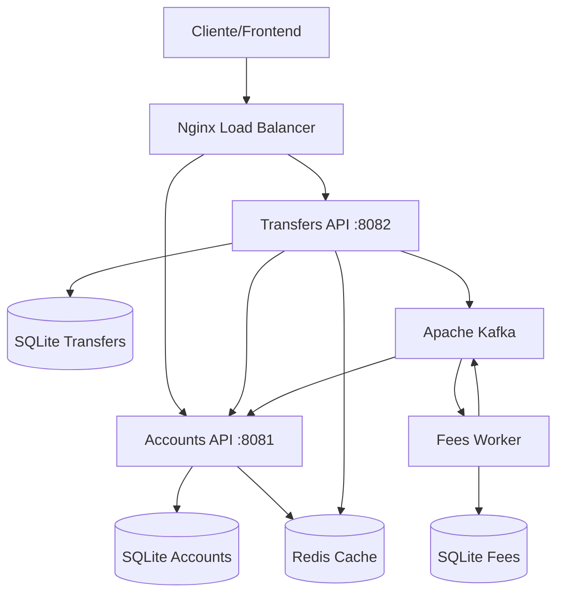

# AnaBank - Arquitetura e Design

## ??? Visão Geral da Arquitetura

O AnaBank foi desenvolvido seguindo os princípios de **Domain-Driven Design (DDD)** e **CQRS (Command Query Responsibility Segregation)**, implementado em **.NET 8** com microsserviços independentes.

## ?? Diagrama de Arquitetura

## ??? Camadas da Arquitetura (DDD)

### **Domain Layer**
- **Entities**: CurrentAccount, Movement, Transfer
- **Value Objects**: CPF, AccountNumber
- **Domain Services**: Validações de negócio
- **Interfaces**: Contratos para infraestrutura

### **Application Layer** 
- **Commands**: RegisterAccount, MakeMovement, MakeTransfer
- **Queries**: GetBalance
- **Handlers**: Lógica de aplicação usando MediatR
- **Validators**: FluentValidation para regras
- **Behaviors**: Cross-cutting concerns (validação, logging)

### **Infrastructure Layer**
- **Repositories**: Implementação com Dapper + SQLite
- **External Services**: JWT, HTTP Clients, Kafka
- **Data Access**: Connection Factory, Migrations

### **API Layer**
- **Controllers**: Endpoints REST
- **Middleware**: JWT, Idempotência, Exception Handling
- **Configuration**: DI, Swagger, CORS

## ?? Padrões Implementados

### **CQRS (Command Query Responsibility Segregation)**
- **Commands**: Operações que modificam estado
- **Queries**: Operações de leitura
- **Handlers**: Separação clara de responsabilidades
- **MediatR**: Desacoplamento entre controllers e lógica

### **DDD (Domain-Driven Design)**
- **Ubiquitous Language**: Linguagem comum entre negócio e código
- **Bounded Contexts**: Accounts, Transfers, Fees
- **Aggregates**: Entidades com consistência transacional
- **Domain Events**: Kafka para comunicação assíncrona

### **Microservices Patterns**
- **Database per Service**: Cada serviço tem seu banco
- **API Gateway**: Nginx como proxy reverso
- **Service Communication**: HTTP síncrono + Kafka assíncrono
- **Health Checks**: Monitoramento de saúde

## ?? Segurança

### **Autenticação e Autorização**
- **JWT Bearer Tokens**: Stateless authentication
- **Token Validation**: Middleware customizado
- **Claim-based Authorization**: Identificação de usuários
- **HTTPS**: Comunicação segura (produção)

### **Proteção de Dados**
- **Password Hashing**: BCrypt com salt único
- **CPF Validation**: Algoritmo padrão brasileiro
- **Input Validation**: FluentValidation + Model binding
- **SQL Injection**: Proteção via Dapper parametrizado

## ?? Idempotência

### **Implementação**
- **Idempotency-Key Header**: Cliente envia chave única
- **Middleware**: Intercepta e valida requisições
- **Storage**: SQLite para cache de respostas
- **Retry Safety**: Operações seguras para reenvio

## ?? Observabilidade

### **Logging**
- **Structured Logging**: JSON format
- **Log Levels**: Debug, Info, Warning, Error
- **Correlation IDs**: Rastreamento de requisições
- **Performance Metrics**: Tempo de resposta

### **Health Checks**
- **Application Health**: `/health` endpoints
- **Database Connectivity**: Verificação de conexões
- **External Services**: Status de dependências
- **Docker Health**: Container monitoring

## ??? Persistência

### **Database Design**
- **SQLite**: Simplicidade e portabilidade
- **Schema per Service**: Isolamento de dados
- **ACID Transactions**: Consistência garantida
- **Connection Pooling**: Performance otimizada

### **Data Access**
- **Dapper**: Micro-ORM performático
- **Repository Pattern**: Abstração de dados
- **Connection Factory**: Gerenciamento de conexões
- **Migration Scripts**: Versionamento de schema

## ?? Qualidade e Testes

### **Testes Automatizados**
- **Unit Tests**: xUnit + FluentAssertions
- **Integration Tests**: WebApplicationFactory
- **Test Isolation**: Banco em memória
- **Coverage Reports**: Cobertura de código

### **Validação**
- **Business Rules**: Domain layer validation
- **Input Validation**: FluentValidation
- **API Contracts**: Swagger/OpenAPI
- **Error Handling**: ProblemDetails RFC

## ?? Containerização

### **Docker Strategy**
- **Multi-stage Builds**: Otimização de imagens
- **Container per Service**: Isolamento e escalabilidade
- **Docker Compose**: Orquestração local
- **Health Checks**: Container monitoring

### **Production Ready**
- **Environment Variables**: Configuração externa
- **Secrets Management**: Configuração segura
- **Volume Mounts**: Persistência de dados
- **Network Isolation**: Segurança de rede

## ?? Escalabilidade

### **Horizontal Scaling**
- **Stateless Services**: Facilita replicação
- **Load Balancing**: Nginx como proxy
- **Database Scaling**: Read replicas (futuro)
- **Cache Layer**: Redis para performance

### **Performance**
- **Async Operations**: Non-blocking I/O
- **Connection Pooling**: Reutilização de conexões
- **Response Caching**: HTTP caching headers
- **Compression**: Gzip para payloads

## ?? DevOps e CI/CD

### **Build Pipeline**
- **Multi-stage Dockerfile**: Build otimizado
- **Test Automation**: Execução automática
- **Quality Gates**: Coverage e linting
- **Artifact Publishing**: Container registry

### **Deployment**
- **Environment Separation**: Dev/Staging/Prod
- **Configuration Management**: appsettings per env
- **Secret Management**: Environment variables
- **Rolling Updates**: Zero-downtime deployment